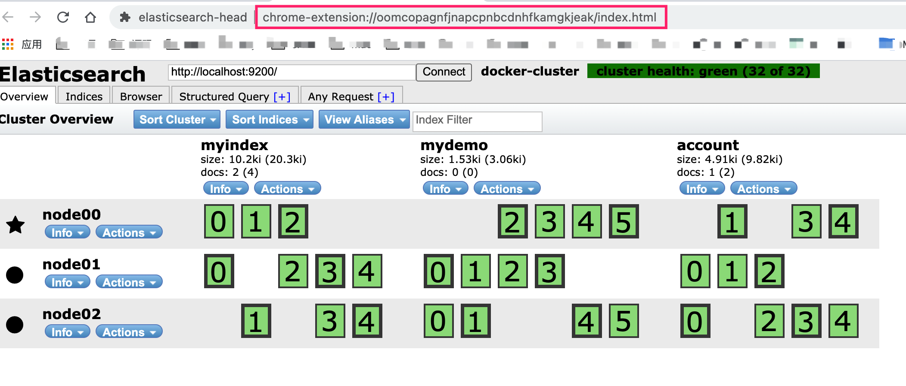

# 基于Docker的Elasticsearch6服务器集群搭建
ES版本： 6.5.4
Docker 4.7.1 

~~~sh
# 重新部署并启动集群
sh cluster.sh

# 查看日志
docker logs -f es-node00
docker logs -f es-node01
docker logs -f es-node02

# 启动es集群
docker start es-node00 es-node01 es-node02
# 停止es集群
docker stop es-node00 es-node01 es-node02

# 查看容器文件目录变化
docker diff es-node00
~~~

## docker参数说明
-itd 表示后台交互式运行
--name 指定容器名称
-p 端口映射 本地端口:容器端口
nodeXX中的文件为每个节点独立的配置和数据文件
plugins config 文件夹中的为集群共享的数据文件
config/ingest-geoip 这个里面的数据库目前已经更新到2022-10-13版本

~~~sh
docker run -itd --name es-node00 -p 9200:9200 -p 9300:9300 \
    -v $PWD/node00/elasticsearch.yml:/usr/share/elasticsearch/config/elasticsearch.yml \
    -v $PWD/node00/jvm.options:/usr/share/elasticsearch/config/jvm.options \
    -v $PWD/node00/data:/usr/share/elasticsearch/data \
    -v $PWD/node00/logs:/usr/share/elasticsearch/logs \
    -v $PWD/plugins:/usr/share/elasticsearch/plugins \
    -v $PWD/config/ingest-geoip:/usr/share/elasticsearch/config/ingest-geoip \
    elasticsearch:6.5.4
~~~
- 加载目录说明
$PWD/plugins  config 为集群中所有的节点共享的数据
plugins 为插件
config/ingest-geoip 这个是geoip数据库，最新的数据库可以从这里下载 https://github.com/P3TERX/GeoLite.mmdb/releases
默认的数据库路径 /usr/share/elasticsearch/config/ingest-geoip

## 关于插件
es6默认加载了 geoip和 user-agent插件，这2个插件如果本地没有，需要先启动es-node00容器，然后执行下面的命令从容器从拷贝出来
~~~sh
docker cp -a es-node00:/usr/share/elasticsearch/plugins plugins

##IK分词下载安装
wget -O ik-654.zip https://github.com/medcl/elasticsearch-analysis-ik/releases/download/v6.5.4/elasticsearch-analysis-ik-6.5.4.zip
unzip -d plugins/ik ik-654.zip # 解压ik-654.zip到plugins/ik文件夹
~~~

## elasticsearch.yml 配置文件

~~~yml
cluster.name: "docker-cluster" #集群名称，集群中的所有节点的这个集群名称必须保持一致，因为ES是通过这个名称来发现其他ES节点的
network.host: 0.0.0.0 # 这个生产环境需要设置为服务器的IP地址，Docker容器部署可以默认0.0.0.0

# minimum_master_nodes need to be explicitly set when bound on a public IP
# set to 1 to allow single node clusters
# Details: https://github.com/elastic/elasticsearch/pull/17288
# 注意，这里如果是单机则默认为1， 如果是集群部署需要根据集群node的数量来设置，计算公式：(N/2)+1，N为集群中节点数
discovery.zen.minimum_master_nodes: 2

# es集群新增配置

node.name: node00 # 节点名称，集群中的每个节点名称必须唯一
node.master: true # 这里设置为true即表示当前节点有机会被选举为master, false这表示当前节点为子节点
node.data: true # 数据节点
http.port: 9200 # 这里的端口，如果docker运行模式为 --net host 则其他的节点需要修改这个端口，以便在主机能暴露出来
# zen discovery集群广播，transport 通信端口默认是9300， 这里的是集群中其他节点的地址，ES通过这里的配置来与其他节点通信 
# 目前ES是3个节点，所以有3个地址
discovery.zen.ping.unicast.hosts: ["192.168.2.8:9300","192.168.2.8:9301","192.168.2.8:9302"]
http.cors.enabled: true
http.cors.allow-origin: "*"

# 磁盘分配策略 这里的空间大小需要根据服务器的使用空间来进行调整。 注意这里设置不当可能会导致ES无法写入数据
# https://www.elastic.co/guide/en/elasticsearch/reference/6.5/disk-allocator.html
# 默认true,如果设置为false 则禁用磁盘分配策略，建议仅开发环境时设置为 false
cluster.routing.allocation.disk.threshold_enabled: true 
# 磁盘分配策略配置
cluster.routing.allocation.disk.watermark.low: "1g"
cluster.routing.allocation.disk.watermark.high: "500m"
cluster.routing.allocation.disk.watermark.flood_stage: "500m"
cluster.info.update.interval: "1m"

~~~

discovery.zen.minimum_master_nodes 选举主节点的最小node,这个需要根据集群数量调整
discovery.zen.ping.unicast.hosts 这个需要根据集群机器的数量来配置，
如果仅是本机测试可以只配置一个本机的IP地址,即： discovery.zen.ping.unicast.hosts: ["192.168.2.8"]

## jvm 配置
jvm.options 文件中对内存的使用做了调整，128m 为本地开发环境使用，
生产环境需要根据服务器的配置来调整es的可用内存， es默认是4g 
~~~options
# Xms represents the initial size of total heap space
# Xmx represents the maximum size of total heap space

-Xms128m
-Xmx128m

~~~

## Elasticsearch数据可视化工具elasticsearch-head配置

这里使用chrome插件的方式，插件代码位于 chrome_ext/es-head
安装方法为打开chrome扩展程序管理，加载已解压的扩展程序 选择上面的目录即可安装成功！

## ES集群磁盘使用配置

https://www.elastic.co/guide/en/elasticsearch/reference/6.5/disk-allocator.html

elasticsearch.yml配置文件中
cluster.routing.allocation.disk.threshold_enabled
默认为true。设置为false禁用磁盘分配决策程序。

cluster.routing.allocation.disk.watermark.low
控制磁盘使用的低水位线。它默认为85%，这意味着Elasticsearch不会将分片分配给使用磁盘超过85％的节点。它也可以设置为绝对字节值（如500mb），以防止Elasticsearch在小于指定的可用空间量时分配分片。此设置不会影响新创建的索引的主分片，或者特别是之前从未分配过的任何分片。

cluster.routing.allocation.disk.watermark.high
控制高水印。它默认为90%，意味着Elasticsearch将尝试从磁盘使用率超过90％的节点重新定位分片。它也可以设置为绝对字节值（类似于低水印），以便在节点小于指定的可用空间量时将其从节点重新定位。此设置会影响所有分片的分配，无论先前是否分配。

cluster.routing.allocation.disk.watermark.flood_stage
控制洪水阶段水印。它默认为95％，这意味着Elasticsearch index.blocks.read_only_allow_delete对每个索引强制执行只读索引块（），该索引在至少有一个磁盘超过泛洪阶段的节点上分配了一个或多个分片。这是防止节点耗尽磁盘空间的最后手段。一旦有足够的可用磁盘空间允许索引操作继续，就必须手动释放索引块。

An example of updating the low watermark to at least 100 gigabytes free, a high watermark of at least 50 gigabytes free, and a flood stage watermark of 10 gigabytes free, and updating the information about the cluster every minute:
~~~sh
PUT _cluster/settings
{
  "transient": {
    "cluster.routing.allocation.disk.watermark.low": "100gb",
    "cluster.routing.allocation.disk.watermark.high": "50gb",
    "cluster.routing.allocation.disk.watermark.flood_stage": "10gb",
    "cluster.info.update.interval": "1m"
  }
}
~~~

开发环境本机磁盘可用空间不多，则设置为
~~~sh
{{url}}/_cluster/settings
{
  "transient": {
    "cluster.routing.allocation.disk.watermark.low": "1g",
    "cluster.routing.allocation.disk.watermark.high": "500m",
    "cluster.routing.allocation.disk.watermark.flood_stage": "500m",
    "cluster.info.update.interval": "1m"
  }
}
~~~
表示磁盘最少有1g可用空间，可用空间小于500m时ES会将其从节点重新分配，节点最少保留500m可用空间

## 集群节点 

ELasticsearch的集群是由多个节点组成的，通过cluster.name设置集群名称，并且用于区分其它的集群，每个节点通过node.name指定节点的名称。 在Elasticsearch中，节点的类型主要有4种:

- master节点

配置文件中node.master属性为true(默认为true)，就有资格被选为master节点。

master节点用于控制整个集群的操作。比如创建或删除索引，管理其它非master节点等。 

- data节点

配置文件中node.data属性为true(默认为true)，就有资格被设置成data节点。

data节点主要用于执行数据相关的操作。比如文档的CRUD。 

- 客户端节点

配置文件中node.master属性和node.data属性均为false。 

该节点不能作为master节点，也不能作为data节点。 

可以作为客户端节点，用于响应用户的请求，把请求转发到其他节点

- 部落节点

当一个节点配置tribe.*的时候，它是一个特殊的客户端，它可以连接多个集群，在所有连接的集群上执 行搜索和其他操作。

## 插件使用示例
ik自定义词典使用示例

### ik分词使用示例
~~~sh
GET {{url}}/_analyze
{
    "analyzer": "ik_max_word",
    "text": "我是中国人"
}
~~~
返回：
~~~json
{
    "tokens": [
        {
            "token": "中国人",
            "start_offset": 2,
            "end_offset": 5,
            "type": "CN_WORD",
            "position": 2
        },
        {
            "token": "中国",
            "start_offset": 2,
            "end_offset": 4,
            "type": "CN_WORD",
            "position": 3
        },
        {
            "token": "国人",
            "start_offset": 3,
            "end_offset": 5,
            "type": "CN_WORD",
            "position": 4
        }
    ]
}
~~~

### ingest-geoip插件使用
该geoip处理器可以与Maxmind的其他GeoIP2数据库一起运行。必须将文件复制到ingest-geoip config目录中，目录位于$ES_CONFIG/ingest-geoip。
~~~sh
PUT {{url}}/_ingest/pipeline/geoip
{
  "description" : "Add geoip info",
  "processors" : [
    {
      "geoip" : {
        "field" : "ip"
      }
    }
  ]
}

# 添加数据指定处理器为geoip
PUT {{url}}/myindex/_doc/123?pipeline=geoip
{
  "ip": "8.8.8.8"
}
~~~

#查询数据
GET {{url}}/myindex/_doc/123
返回结果：
~~~json
{
    "_index": "myindex",
    "_type": "_doc",
    "_id": "123",
    "_version": 1,
    "found": true,
    "_source": {
        "geoip": {
            "continent_name": "North America",
            "country_iso_code": "US",
            "location": {
                "lon": -97.822,
                "lat": 37.751
            }
        },
        "ip": "8.8.8.8"
    }
}
~~~
